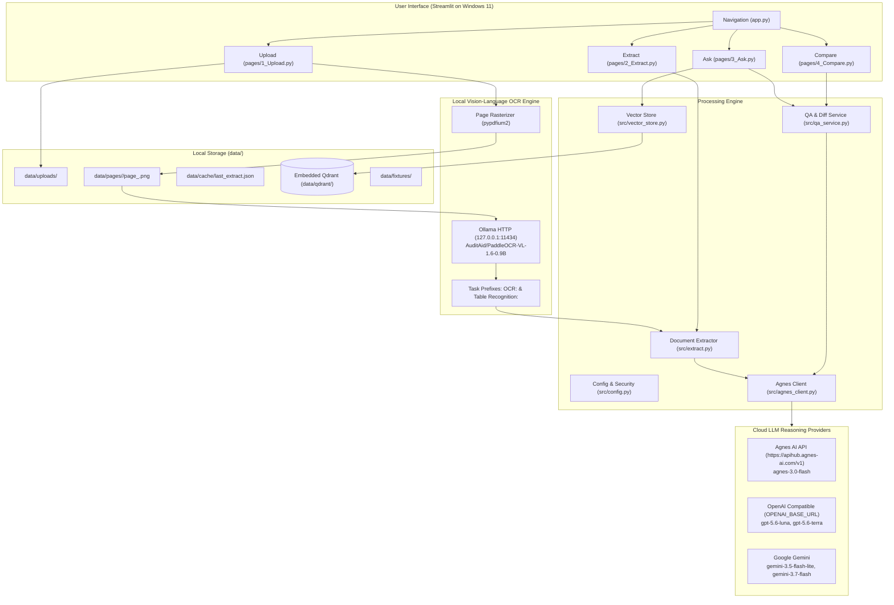

# Document Desk Architecture

This document describes the structure, data flow, storage layouts, and concurrency rules for Document Desk on Windows 11.

## Architecture Overview

Document Desk runs locally on Windows 11. It combines local Vision-Language OCR via Ollama (`AuditAid/PaddleOCR-VL-1.6-0.9B`), structured reasoning through Agnes AI (`agnes-3.0-flash`) or optional discovered providers, and local vector search using an embedded Qdrant database.



## Subsystems

### 1. Configuration and Security (`src/config.py`)

The application reads configuration from environment variables or a local `.env` file:
- `AGNESAI_API_KEY`: Primary API key for Agnes AI. The code checks for presence only and never logs or writes the key to disk or git.
- `AGNES_BASE_URL`: Base URL for Agnes AI, defaulting to `https://apihub.agnes-ai.com/v1`.
- `OLLAMA_HOST`: Local Ollama HTTP endpoint, defaulting to `http://127.0.0.1:11434`.
- `OLLAMA_OCR_MODEL`: Ollama vision-language model, fixed to `AuditAid/PaddleOCR-VL-1.6-0.9B`.
- `OPENAI_API_KEY` and `OPENAI_BASE_URL`: Optional credentials for OpenAI-compatible endpoints (`gpt-5.6-luna`, `gpt-5.6-terra`).
- `GOOGLE_API_KEY`: Optional key for Google Gemini models (`gemini-3.5-flash-lite`, `gemini-3.7-flash`).

Providers whose credentials are not present in the environment are hidden from the sidebar selector. All user-facing errors refer specifically to `AGNESAI_API_KEY`.

### 2. Local Vision-Language OCR (`src/ollama_ocr.py`, `src/render_pages.py`)

- **Model Engine**: Ollama serves `AuditAid/PaddleOCR-VL-1.6-0.9B` locally on Windows 11 without requiring a native PaddlePaddle pip stack.
- **Task Prefixes**: Prompts follow the PaddleOCR-VL protocol:
  - `OCR:` (Default pass for full-page text detection)
  - `Table Recognition:` (Second pass if user enables table extraction)
  - `Formula Recognition:`
  - `Chart Recognition:`
  - `Seal Recognition:`
  - `Spotting:`
- **Image Input Handling**: PDF pages are rendered with `pypdfium2` at 150 DPI to `data/pages/<file_id>/page_<n>.png`. Local PNG and JPEG paths or raw bytes are passed directly as Ollama image attachments.
- **URL Rule**: Local disk paths are never sent to Agnes as public image URLs.
- **Graceful Failure**: If Ollama is offline or the model is missing, the Upload page displays:
  `start Ollama Desktop, then ollama pull AuditAid/PaddleOCR-VL-1.6-0.9B`
  without raising an unhandled exception or crashing Streamlit.

### 3. Document Extraction & Structuring (`src/extract.py`)

- Extracts text per page using Ollama PaddleOCR-VL or PyMuPDF native text.
- Formulates a system prompt enforcing strict JSON output:
  ```json
  {
    "title": "string",
    "doc_type": "string",
    "fields": [{"name": "string", "value": "string | number", "page": 1}],
    "tables": [{"title": "string", "headers": ["..."], "rows": [["..."]]}],
    "summary": "string",
    "citations": [{"claim": "string", "page": 1}]
  }
  ```
- Normalizes and hardens JSON parsing (stripping code fences, trailing commas, and formatting discrepancies).
- Writes extraction results to `data/cache/last_extract.json` for instant subsequent use.

### 4. Embedded Vector Store (`src/vector_store.py`)

Document chunks are indexed into an embedded Qdrant instance stored on disk at `data/qdrant/` under the `documents` collection:
- **Payload Schema**:
  ```json
  {
    "file_id": "string",
    "page": 1,
    "text": "chunk text...",
    "filename": "sample.pdf",
    "chunk_index": 0
  }
  ```
- **Chunking**: Splits text into 500-character windows with 80-character overlaps while preserving page metadata.
- **Search Filtering**: Filtered strictly by `file_id` to guarantee queries isolate chunks from the selected document.
- **Single-Process Rule**: Embedded Qdrant locks its SQLite storage file on disk. Connections are opened for individual read/write operations and closed immediately to prevent lingering file locks.

### 5. LLM Client (`src/agnes_client.py`)

Calls to Agnes AI or optional providers use the official `openai` Python SDK:
- Default endpoint: `https://apihub.agnes-ai.com/v1` with model `agnes-3.0-flash`.
- Retries on HTTP 429 rate limit responses using exponential backoff starting at 1.5 seconds.
- Handles HTTP 401 and 403 errors by providing a clear message pointing to `AGNESAI_API_KEY`.

### 6. Grounded Q&A and Document Comparison (`src/qa_service.py`)

- **Grounded Q&A**: Assembles retrieved chunks into context. Instructs `agnes-3.0-flash` to answer strictly from provided excerpts and attach explicit page citations (e.g. `[Page 1]`). If retrieval is empty, it clearly reports that no relevant chunks were found.
- **Field-Level Diffing**:
  1. Computes exact Python set difference on field names: `common_fields`, `only_in_a`, and `only_in_b`.
  2. Prompts `agnes-3.0-flash` to perform a detailed comparison of values across shared fields, outputting a structured Markdown diff report.
