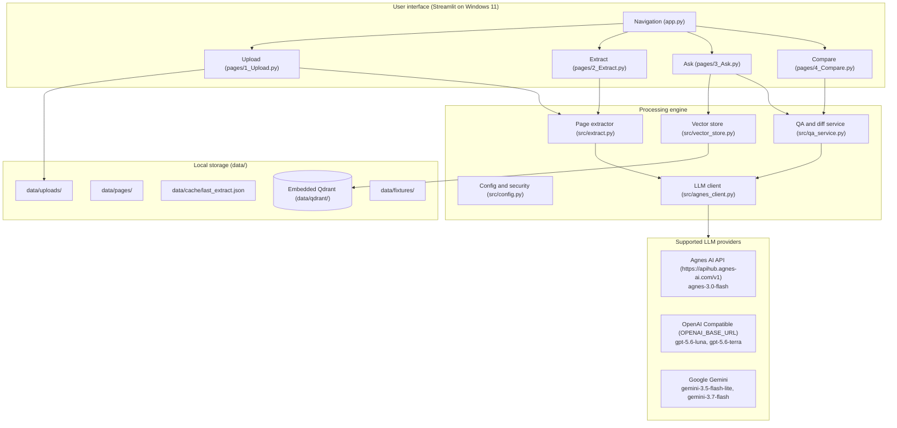

# Document Desk architecture

This document describes the structure, data flow, storage layouts, and concurrency rules for Document Desk on Windows 11.

## Architecture overview

Document Desk runs locally on Windows 11. It combines local PDF text extraction via PyMuPDF, structured reasoning through Agnes AI (`agnes-3.0-flash`) or optional discovered providers, and local vector search using an embedded Qdrant database.



## Subsystems

### Configuration and security (`src/config.py`)

The application reads configuration from environment variables or a local `.env` file:
- `AGNESAI_API_KEY`: Primary API key for Agnes AI. The code checks for presence only and never logs or displays the value.
- `AGNES_BASE_URL`: Base URL for Agnes AI, defaulting to `https://apihub.agnes-ai.com/v1`.
- `OPENAI_API_KEY` and `OPENAI_BASE_URL`: Optional credentials for OpenAI-compatible endpoints (`gpt-5.6-luna`, `gpt-5.6-terra`).
- `GOOGLE_API_KEY`: Optional key for Google Gemini models (`gemini-3.5-flash-lite`, `gemini-3.7-flash`).

Providers whose credentials are not present in the environment are hidden from the sidebar selector. All user-facing errors refer specifically to `AGNESAI_API_KEY`.

### Page extraction (`src/extract.py`)

PyMuPDF extracts text page by page from uploaded files:
- v1 is text-first. No PaddleOCR in v1.
- If a page has fewer than 20 characters of extractable text, the system flags a warning that vision requires a public image URL and that v1 is text-first.
- The system never passes local disk paths as image URLs. It sends whatever text exists across the document.
- Documents are processed through the chosen model to produce a JSON object with title, doc_type, fields, tables, summary, and citations.
- The parser cleans common formatting issues such as markdown fences and trailing commas before loading JSON.
- Results are saved to `data/cache/last_extract.json` for reuse.

### Embedded vector store (`src/vector_store.py`)

Document chunks are indexed into an embedded Qdrant instance stored on disk at `data/qdrant/` under the `documents` collection:
- Payload schema:
  ```json
  {
    "file_id": "string",
    "page": 1,
    "text": "chunk text...",
    "filename": "sample.pdf",
    "chunk_index": 0
  }
  ```
- Chunking splits text into segments of about 500 characters with an 80-character overlap while keeping track of page numbers.
- Searches filter chunks strictly by `file_id` so that questions retrieve text only from the selected document.
- Embedded Qdrant locks its SQLite storage file on disk. Connections are opened for individual operations and closed immediately afterward. Only one process should access `data/qdrant/` at a time.

### LLM client (`src/agnes_client.py`)

Calls to Agnes AI or optional providers use the official `openai` Python SDK:
- Default endpoint: `https://apihub.agnes-ai.com/v1` with model `agnes-3.0-flash`.
- Retries on HTTP 429 rate limit responses using exponential backoff starting at 1.5 seconds.
- Handles HTTP 401 and 403 errors by providing a clear message pointing to `AGNESAI_API_KEY`.

### Grounded Q&A and document comparison (`src/qa_service.py`)

- Question answering: Queries top-scoring chunks from Qdrant by `file_id`. If no chunks return, the system states that retrieval was empty rather than guessing an answer. When chunks are found, the model answers using only the provided text and cites the source page in brackets, such as `[Page 1]`.
- Field comparison: Compares two document IDs. First, Python calculates the set difference of field names (`common_fields`, `only_in_a`, and `only_in_b`). Then the model evaluates only the field dictionaries to generate a table of changed values and a summary of differences.

## Data flow

### Ingestion and extraction flow

```
[User upload]
       │
       ▼
[Save to data/uploads/<filename>]
       │
       ▼
[PyMuPDF page check] ─── (text length < 20?) ───► YES ──► [Warn: vision needs public URL]
       │                                                         │
       ▼ NO                                                      ▼
[Collect page text] ◄──────────────────────────────── [Send whatever text exists]
       │
       ▼
[Concatenate document text]
       │
       ▼
[LLM (agnes-3.0-flash)] ───► [JSON: title, doc_type, fields, tables, summary, citations]
                                    │
                                    ├──► [Save data/cache/last_extract.json]
                                    └──► [Streamlit: editable table and JSON views]
```

### Semantic indexing and search flow

```
[Extracted pages with page metadata]
       │
       ▼
[Text chunking (~500 chars)]
       │
       ▼
[Upsert to embedded Qdrant (data/qdrant/)] ◄─── Payload: {file_id, page, text}
       │
       ▼
[User question in Document Desk]
       │
       ▼
[Filter query by file_id (limit k)]
       │
       ├──── (Retrieval empty?) ──► YES ──► Display empty retrieval message
       │
       ▼ NO
[Context chunks with page metadata]
       │
       ▼
[LLM prompt: answer from context only, cite pages]
       │
       ▼
[Display answer with [Page X] citations and chunk inspector]
```

## Concurrency and system constraints

- Native Windows 11: All scripts, commands, and paths run directly on Windows 11 without WSL2 or Docker.
- Qdrant single-process access: Embedded Qdrant locks its SQLite files on disk via portalocker. Only one Python or Streamlit process should interact with `data/qdrant/` at any given time.
- Secret handling: `AGNESAI_API_KEY` is checked for existence before making network calls, but is never printed or logged.
