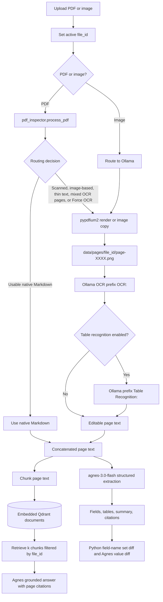

# Document Desk architecture

Document Desk is a single-process, Windows-native Streamlit application.
Upload sets a `file_id`, and Streamlit session state carries it through Inspect,
optional OCR, Extract, and Ask.

## Pipeline



## Routing boundary

`src/pdf_inspect.py` calls the local `pdf-inspector` package and returns the
normalized PDF type, confidence, page count, Markdown, route, and route reason.

The native route is used when Markdown is substantial and no OCR condition
applies. Ollama is used for:

- Forced OCR
- `scanned` or `image_based` PDFs
- Empty or thin native Markdown
- `mixed` PDFs with pages identified as needing OCR
- Uploaded images

No PDF page is rasterized on the native route.

## Local OCR boundary

`src/render_pages.py` uses `pypdfium2` for PDF rasterization from 150 to 200 DPI.
It writes PNG files under `data/pages/<file_id>/`. Uploaded images are converted
to `page-0001.png` in the same directory.

`src/ollama_ocr.py` attaches those local PNGs through the Ollama client's
`images` field. OCR runs at temperature `0` using the fixed model
`AuditAid/PaddleOCR-VL-1.6-0.9B`.

Agnes never receives local image paths.

## Agnes boundary

`src/extract.py` sends concatenated native Markdown and/or editable OCR page
text to `agnes-3.0-flash` through the official `openai` SDK. Authentication uses
`AGNESAI_API_KEY` and base URL `https://apihub.agnes-ai.com/v1`.

The hardened parser selects the first valid JSON object in the response and
normalizes it to:

```json
{
  "title": "string",
  "doc_type": "string",
  "fields": [{"name": "string", "value": "value", "page": 1}],
  "tables": [],
  "summary": "string",
  "citations": [{"claim": "string", "page": 1}]
}
```

The Agnes client performs exponential backoff for HTTP `429` responses.

## Storage and retrieval

`src/store.py` is the canonical embedded-Qdrant implementation.
`src/vector_store.py` keeps compatibility imports for older callers.

- Path: `data/qdrant`
- Collection: `documents`
- Payload: `{file_id, page, text}`
- Retrieval filter: exact `file_id`

Extract replaces existing points for the active `file_id`, indexes the current
page text, and enables Ask for that file. Ask sends only retrieved chunks to
Agnes and requires page citations. Empty retrieval results do not call Agnes.

Embedded Qdrant is local and single-process. Only one Streamlit process may use
`data/qdrant` at a time.

## User-interface state

`app.py` initializes shared session state before `st.navigation` runs.

| State key | Purpose |
| --- | --- |
| `current_file_id` | Active document identity established on Upload |
| `inspect_<file_id>` | Classification, route, and route reason |
| `ocr_results_<file_id>` | OCR output for routed pages |
| `page_text_<file_id>_<page>` | User-edited OCR text |
| `extract_data_<file_id>` | Structured extraction; enables Ask |
| `ask_data_<file_id>` | Question, cited answer, and retrieved chunks |

The downstream pages do not select a separate document. They consume the active
`file_id`, preventing extraction or retrieval from drifting to another file.
