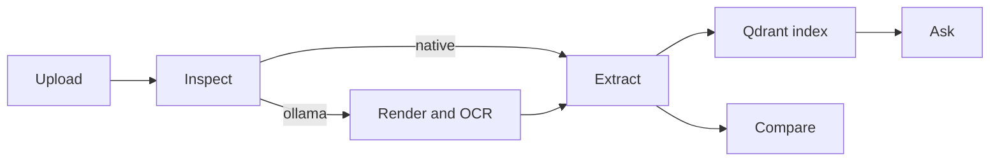

# Developer guide

This reference covers Document Desk's code and operating contracts. Start with
[developer onboarding](ONBOARDING.md) for a first local run or the
[tutorial](TUTORIAL_ZERO_TO_MASTERY.md) for a guided workflow.

## System model

Streamlit session state holds one active `file_id`. Upload sets it, and Inspect,
OCR, Extract, and Ask use that same value. This keeps extraction and retrieval
on the selected document.

PDFs use `pdf_inspector.process_pdf`. Usable native Markdown stays on the
native path. Scanned, image-based, thin-text, and forced-OCR documents go to
local Ollama, which triggers `pypdfium2` page rendering. Agnes receives text,
never local image paths.

## Module map

| Module | Responsibility |
| --- | --- |
| `src/config.py` | Paths, environment names, model IDs, and task-prefix constants. |
| `src/pdf_inspect.py` | Local `pdf-inspector` call, normalized result, routing decision, and route reason. |
| `src/render_pages.py` | Routed PDF/image conversion to `data/pages/<file_id>/page-XXXX.png`. |
| `src/ollama_ocr.py` | Ollama health checks and OCR/table requests with retry. |
| `src/extract.py` | Page-text assembly, hardened Agnes JSON parsing, and extraction normalization. |
| `src/store.py` | Embedded Qdrant chunks, file-scoped retrieval, and local vector creation. |
| `src/qa_service.py` | Grounded answers and Python/Agnes comparison helpers. |
| `src/agnes_client.py` | Official OpenAI SDK client and retrying Agnes completion calls. |

`src/pdf_pages.py`, `src/vector_store.py`, and `src/document_processor.py` are
compatibility wrappers. New code should normally import the canonical modules
listed above.

## Public API contracts

The supported implementation surface is `src/`. Public classes and functions
use Google-style docstrings with typed signatures and meaningful errors.

| Area | Primary entry points |
| --- | --- |
| Inspection | `inspect_pdf` |
| Rendering | `sanitize_file_id`, `render_page`, `render_all_pages` |
| OCR | `check_ollama_status`, `run_ollama_ocr_page`, `run_page_ocr` |
| Extraction | `extract_document_pages`, `extract_pages`, `extract_with_agnes`, `parse_and_harden_json` |
| Storage | `get_qdrant_client`, `index_document_pages_or_text`, `search_document_chunks` |
| Question answering | `answer_question_with_page_citations`, `compute_field_set_diff`, `diff_document_fields` |
| Agnes transport | `get_llm_client`, `chat_completion_with_retry` |

`ExtractionResult.to_dict()` is the normalized extraction boundary. It emits
`title`, `doc_type`, `fields`, `tables`, `summary`, and `citations`.

## Data and service boundaries

| Boundary | Contract |
| --- | --- |
| Agnes key | Read only from `AGNESAI_API_KEY`; never log or persist the value. |
| Local OCR | Use Ollama at `OLLAMA_HOST` with exact model `AuditAid/PaddleOCR-VL-1.6-0.9B`. |
| OCR prompts | First pass starts `OCR:`; optional table pass starts `Table Recognition:`; temperature is `0`. |
| PDF handling | Use `pdf_inspector.process_pdf`; do not use `process_pdf_with_ocr`, PyMuPDF, or `fitz`. |
| Qdrant | One process owns `data/qdrant`; collection `documents`; payload exactly `{file_id, page, text}`. |
| Generated files | Uploads, page PNGs, caches, fixtures, and Qdrant data live below gitignored `data/`. |

## Session-state contract

| Key pattern | Meaning |
| --- | --- |
| `current_file_id` | Active document established by Upload. |
| `inspect_<file_id>` | Inspection data, route, and human-readable route reason. |
| `ocr_results_<file_id>` | Per-page local OCR results for an OCR-routed file. |
| `page_text_<file_id>_<page>` | User-edited OCR text used by Extract. |
| `extract_data_<file_id>` | Structured output; its presence enables Ask. |
| `ask_data_<file_id>` | Question, cited answer, and retrieved chunks. |

## Verification reference

| Command | Prerequisites | What it checks |
| --- | --- | --- |
| `scripts\smoke_inspect.py` | Local dependencies | `pdf-inspector`, native routing, and `last_inspect.json`. |
| `scripts\smoke_workflow.py` | Local dependencies | Active-file state, native OCR skip, Ask gate, and exports. |
| `scripts\smoke_ocr.py` | Ollama and OCR model | Fixture OCR and `last_ocr.json`. |
| `scripts\smoke_ollama_route.py` | Ollama and OCR model | Forced OCR route, rendering, and OCR cache. |
| `scripts\smoke_extract.py` | Agnes key plus cached text | Extraction, Qdrant indexing, grounded Ask, and caches. |
| `scripts\smoke_extract_ask.py` | Agnes key; Ollama if no OCR cache | End-to-end OCR text, Extract, Ask, and Compare. |

Run scripts from the repository root with `.venv\Scripts\python.exe`.
Do not run a Qdrant-writing script while Streamlit is using `data/qdrant`.

## Documentation coverage

The public `src` surface contains 42 symbols: top-level classes/functions and
the public `ExtractionResult.to_dict` method. Keep coverage at 42/42 unless the
same change intentionally adds or removes a public API.

## Extension checklist

1. Keep new file processing behind the active `file_id` contract.
2. Preserve text-only input to Agnes and image-only input to Ollama.
3. Add or update a focused smoke before changing user-visible behavior.
4. Update the relevant guide, runbook, and public docstrings in the same pull
   request.
5. Run the applicable checks in [CONTRIBUTING.md](../CONTRIBUTING.md).
